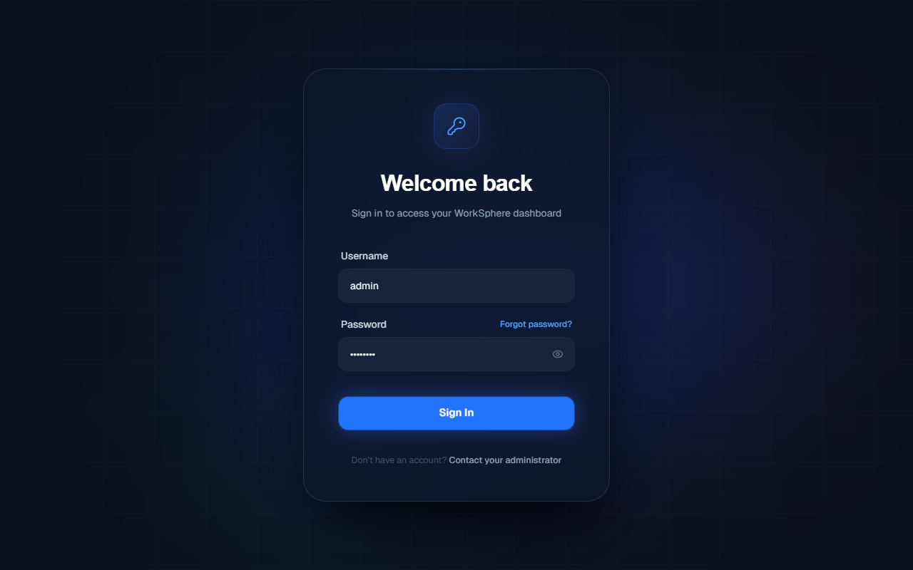
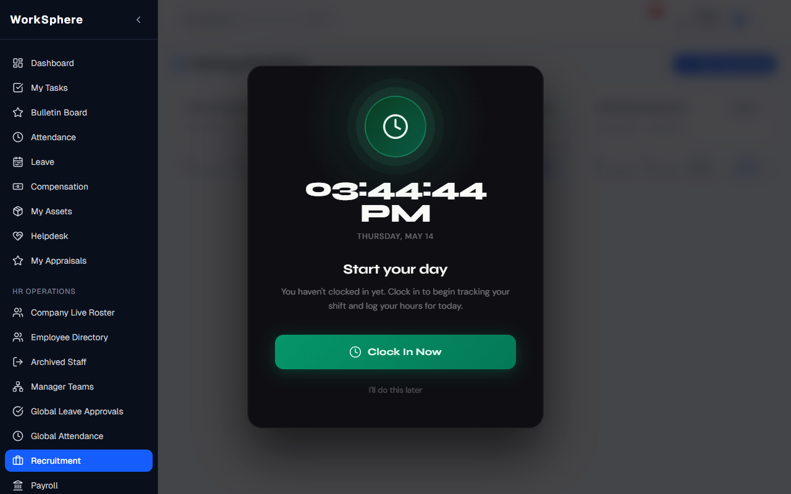
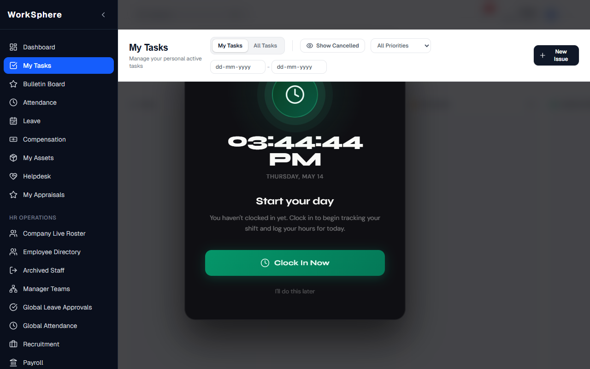
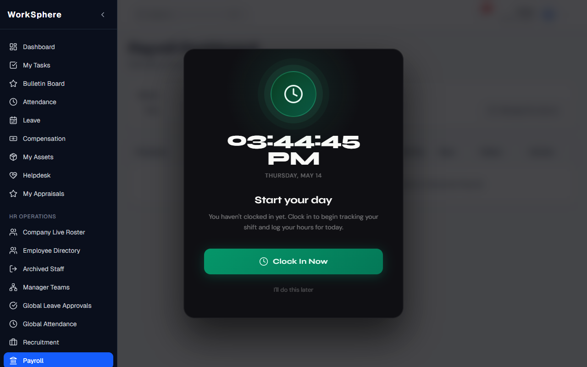

# WorkSphere 🏢

> **A modern, full-stack Human Resources and Operations Management Platform.**

WorkSphere is a comprehensive internal platform built to manage the complete employee lifecycle. From an applicant tracking system (ATS) to payroll calculation, leave management, and daily task operations, WorkSphere provides modern HR workflows in a unified, performant application.

## 📸 Screenshots

| Dashboard | ATS Kanban Board |
|-----------|------------------|
|  |  |
| **Task Management** | **Payroll Overview** |
|  |  |

## ✨ Features

- **Applicant Tracking System (ATS):** Drag-and-drop Kanban board for interview pipelines, feedback logging, and automated offer generation.
- **Core HR Hub:** Centralized employee directory, hierarchical team management, and self-service portals for personnel data.
- **Leave Management:** Configurable leave policies, hierarchical manager approvals, and automated balance ledger tracking.
- **Payroll & Compensation:** Salary structure templating, component breakdown (Base, HRA, DA), and draft-to-final payroll runs.
- **Task & Operations Engine:** Manager-assigned tasks, evidence uploading, strict status progression, auditor flags, and performance ratings.
- **Asset & Helpdesk Management:** Internal ticketing for IT/HR support and company equipment inventory tracking.
- **Granular RBAC:** Deep, role-based access control protecting endpoints via JWT (Roles: `EMPLOYEE`, `MANAGER`, `HR`, `SUPER_ADMIN`, `AUDITOR`).

## 🛠 Tech Stack

### Frontend (Client)
- **Framework:** React 19 + Vite
- **Styling:** Tailwind CSS v4, Shadcn UI (Radix Primitives)
- **State & Data Fetching:** React Query (TanStack), Axios
- **Routing:** React Router v7
- **Data Visualization:** Recharts
- **Interactions:** `@hello-pangea/dnd` (Kanban), `lucide-react` (Icons)

### Backend (Server)
- **Framework:** Java 21, Spring Boot 3
- **Security:** Spring Security 6, JWT Authentication
- **Data Access:** Hibernate, Spring Data JPA
- **Database:** PostgreSQL (H2 for testing)
- **Build Tool:** Maven

## 🏗 Architecture Overview

Multi-role request pipeline: JWT filter validates and extracts roles → @PreAuthorize method-level guards enforce hierarchy boundaries → service layer applies organizational scoping before any data is returned.

## 🚀 Installation & Setup

### Prerequisites
- Node.js (v18+)
- Java JDK 21+
- Maven
- PostgreSQL (running locally or via Docker)

### 1. Database Setup
Create a local PostgreSQL database named `worksphere`:
```sql
CREATE DATABASE worksphere;
```

### 2. Environment Variables
Create a `.env` file in the `worksphere/` directory (backend) with the following configurations:

```properties
# worksphere/.env
spring.datasource.url=jdbc:postgresql://localhost:5432/worksphere
spring.datasource.username=postgres
spring.datasource.password=your_db_password

jwt.secret=your_super_secret_jwt_key_that_is_long_enough

spring.mail.host=sandbox.smtp.mailtrap.io
spring.mail.port=2525
spring.mail.username=your_mailtrap_user
spring.mail.password=your_mailtrap_pass
```

### 3. Running the Backend
```bash
cd worksphere
./mvnw clean install
./mvnw spring-boot:run
```
*Note: On the first run, Hibernate will auto-generate the schema, and the application's DataSeeder will populate the database with default departments, roles, generic salary configurations, and default users.*

### 4. Running the Frontend
```bash
cd worksphere-client
npm install
npm run dev
```

## 🔐 Default Local Credentials

If you are running the app with the seeder enabled, you can log in with:

- **Super Admin:** `admin` / `admin123`
- **HR Admin:** `hr_admin` / `password`
- **Manager:** `manager` / `password`
- **Employee:** `ashik` / `password`

## 📖 API Documentation

The backend exposes REST APIs generally categorized by feature. 

### Example: Task Management

**Create a Task (Manager only)**
```http
POST /tasks
Authorization: Bearer <token>
Content-Type: application/json

{
  "title": "Update Q3 Financials",
  "description": "Prepare the slide deck for the Q3 review.",
  "assigneeId": "123e4567-e89b-12d3-a456-426614174000",
  "dueDate": "2026-06-01"
}
```

**Response (200 OK):**
```json
{
  "id": "abc-123",
  "title": "Update Q3 Financials",
  "status": "PENDING",
  "assigneeName": "Ashik Pareeth",
  "createdAt": "2026-05-14T10:00:00Z"
}
```

## 📂 Project Structure

```text
UCOC_Project/
├── worksphere/                     # Spring Boot Backend Code
│   ├── src/main/java/.../
│   │   ├── config/                 # Security, Seeder, CORS
│   │   ├── controller/             # REST API Endpoints
│   │   ├── dto/                    # Data Transfer Objects
│   │   ├── entity/                 # JPA Entities
│   │   ├── exception/              # Global Exception Handlers
│   │   ├── repository/             # Data Access Layer (Spring Data)
│   │   └── service/                # Business Logic
│   └── src/main/resources/         # application.properties
│
└── worksphere-client/              # React Frontend Code
    ├── src/
    │   ├── api/                    # Axios interceptors & services
    │   ├── components/             # Reusable UI (Shadcn, generic)
    │   ├── context/                # React Context (AuthContext)
    │   ├── features/               # Domain-specific modules (hr, tasks, hiring)
    │   └── pages/                  # Route entry points
    ├── package.json
    └── tailwind.config.js
```

## 🧠 Challenges Faced

- **Complex RBAC & Data Masking:** Ensuring that managers only see tasks and leave requests for their direct reports required careful query construction and method-level security implementation.
- **Payroll State Management:** Handling payroll generation idempotency (updating existing drafts vs creating new ones) while preventing overlapping pay periods for the same employee.
- **Progressive Data Editing:** Implementing soft-deletes and non-destructive progressive editing workflows for entities like Job Openings and Tasks to maintain strict audit compliance.

## 🚀 Future Improvements

- **Real-time Notifications:** Replace polling with WebSockets (STOMP over SockJS) for real-time task updates and chat messages.
- **Resume Parsing:** Integrate an AI/LLM service to automatically extract data from uploaded candidate PDFs.
- **Export Capabilities:** Add generic PDF/CSV export functionality for HR reports and audit logs.

## 📄 License

This project is licensed under the MIT License. This platform was originally developed as an academic project and is open for contributions.
